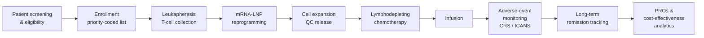

<div align="center">

# Recellion — ImmunoReset Digital Platform

**An end-to-end digital dashboard for an off-the-shelf mRNA CAR-T therapy targeting refractory autoimmune disease in the EU market.**

[](https://car-t-dashboard-course.vercel.app)
[](../LICENSE)
[](#academic-context)
[](#project-status)
[](#sostac-marketing-framework)
[](https://developer.mozilla.org/en-US/docs/Web/HTML)
[](https://developer.mozilla.org/en-US/docs/Web/CSS)
[](https://developer.mozilla.org/en-US/docs/Web/JavaScript)

[Live demo](https://car-t-dashboard-course.vercel.app) · [Features](#features) · [Patient journey](#patient-journey-architecture) · [SOSTAC](#sostac-marketing-framework) · [Run locally](#getting-started) · [Roadmap](#roadmap) · [Team](#team)

</div>

---

## Overview

**Recellion ImmunoReset** is a strategic-marketing concept for an off-the-shelf mRNA CAR-T cell therapy aimed at refractory **Systemic Lupus Erythematosus (SLE)** and **Rheumatoid Arthritis (RA)** in the EU. This repository contains the **interactive single-page dashboard** that accompanies the SOSTAC® marketing plan — covering the full patient journey from screening and enrollment through manufacturing logistics, infusion, adverse-event monitoring, clinical analytics, and commercial planning.

The artefact was produced for the **M9 Strategic Marketing in Life Sciences** master-course module at HTW Berlin. It is an academic demonstration; it is **not** a medical device.

> ⚠️ **Disclaimer.** This dashboard does not process real patient data, is not clinically validated, and is not authorised by the EMA, FDA, or any other regulator. It must not be used for diagnosis, treatment, or commercial decision-making.

## Project status

| | |
|---|---|
| **Phase** | Concept prototype — academic deliverable |
| **Course module** | M9 Strategic Marketing in Life Sciences, HTW Berlin |
| **Submitted** | 2025 |
| **Live URL** | <https://car-t-dashboard-course.vercel.app> |
| **Source size** | Single `index.html` (~1,668 lines), no build step |

## Features

The dashboard is organised around nine working modules:

| Module | What it shows |
|---|---|
| 📊 **Dashboard overview** | Active-patient, manufacturing, adverse-event, and 3-month remission summary cards with animated metric tiles |
| 🔍 **Screening & enrollment** | Eligibility questionnaire (Patient ID, primary diagnosis, refractory status) with priority-coded candidate list (green / yellow / red) |
| 📅 **Therapy logistics** | mRNA CAR-T production pipeline progress bars; scheduling for leukapheresis, infusion, and follow-ups; automated reminder simulation |
| 🛡️ **Adverse-event monitoring** | CRS and ICANS surveillance with severity 1–5 reporting and status-based alerting (e.g. Grade 1 CRS, Stable) |
| 📈 **Clinical insights** | Long-term remission tracking for SLE and RA, AE trend analysis, Patient-Reported Outcomes (PROs), cost-effectiveness vs. lifelong biologics |
| 📚 **Patient & HCP resources** | Patient-journey explainer slots, HCP training modules, FAQs, advocacy-group contacts |
| 🎯 **SOSTAC® plan** | Full six-stage strategic marketing plan (see [below](#sostac-marketing-framework)) |
| 💰 **Cost-comparison calculator** | Configurable inputs comparing lifetime biologics spend against Recellion's one-time CAR-T cost |
| 🔬 **Treatment process demo** | Five-step walkthrough: leukapheresis → mRNA-LNP reprogramming → expansion → chemotherapy & infusion → autoreactive-cell elimination |

A separate **budget analysis** view breaks down Phase 2 / Phase 3 clinical-trial spend and a fully-loaded production cost of **~$3,970 per patient**.

## Patient-journey architecture



Each node in the diagram corresponds to a module in the live dashboard.

## SOSTAC® marketing framework

The dashboard embeds the full strategic plan across the six SOSTAC® stages:

| Stage | Coverage in dashboard |
|---|---|
| **S — Situation analysis** | EU market sizing for SLE / RA, competitive landscape, customer segments |
| **O — Objectives** | Regulatory milestones, market-penetration targets, revenue plan |
| **S — Strategy** | Positioning, segmentation, go-to-market, communication strategy |
| **T — Tactics** | Clinical-development plan, HCP education, patient advocacy, market-access tactics |
| **A — Action** | Timeline from preclinical (Q2 2025) through EU launch (Q2 2029) |
| **C — Control** | KPIs across clinical, regulatory, commercial, financial, and digital metrics |

**Year-1 / Year-2 marketing objectives** — certified centres, physician training volumes, patient throughput, market share, and reimbursement coverage — are tracked in their own section.

## Tech stack

**Current (MVP-0 / academic deliverable)**

- **HTML5** — semantic single-page structure
- **CSS3** — glassmorphism (`backdrop-filter: blur(20px)`), gradients, shimmer animations, responsive layout (breakpoint at 768px)
- **Vanilla JavaScript** — SPA-style navigation, interactive demos, form handling, calculator logic
- **Font Awesome 6** — icon set
- **Inter / Segoe UI** — typography

No frameworks, no build pipeline, no dependencies installed at clone time. Hosted on **Vercel** as a static site with SPA-style rewrites (see [`vercel.json`](vercel.json)).

**Planned (production roadmap)**

`React` · `Node.js / Fastify` · `PostgreSQL` · `Chart.js / D3.js` · `Auth (HCP / Patient roles)` · `Real-time AE alerting` · `EU localisation (DE / FR / ES / IT)`

## Design system

- **Primary gradient** — `#ff69b4` (hot pink) → `#8a2be2` (blue violet)
- **Background** — soft cream-pink wash (`#fce4ec` → `#e1bee7` → `#fff3e0`)
- **Status palette** — green (success) · yellow (warning) · red (alert)
- **Components** — glassmorphism cards, animated progress bars with shimmer, hover micro-animations (translateY / scale / rotate), slide-in toast alerts with auto-dismiss

## Getting started

### Option A — view the deployed demo

Open <https://car-t-dashboard-course.vercel.app> in any modern browser.

### Option B — run locally

Zero build steps, zero dependencies:

```bash
git clone https://github.com/ugrersoz/car-t-dashboard-course.git
cd car-t-dashboard-course/car-t-main

# Quick open
start index.html        # Windows
open  index.html        # macOS
xdg-open index.html     # Linux
```

For a proper local server (recommended so SPA rewrites and `fetch` behave correctly):

```bash
# Python 3
python -m http.server 8080
# then visit http://localhost:8080
```

```bash
# Node
npx serve .
```

## Project structure

```
car-t-dashboard-course/
├── LICENSE                     # MIT
└── car-t-main/                 # All application source (kept nested to match deploy root)
    ├── index.html              # Single-page dashboard (~1,668 lines)
    ├── vercel.json             # Static deploy + SPA rewrite rules
    ├── README.md               # This file
    ├── CONTRIBUTING.md
    └── .gitignore
```

## Roadmap

- [ ] Replace placeholder charts with **Chart.js / D3.js** for real visualisation
- [ ] Add a backend API for persistent patient data
- [ ] Implement role-based authentication (HCP vs. patient)
- [ ] Wire real-time adverse-event alerting (push / SMS / email)
- [ ] Localise for EU markets (DE, FR, ES, IT)
- [ ] Generate downloadable PDF reports for clinical insights

## Regulatory & commercial context

The Recellion concept is positioned against the regulatory frameworks that govern cell and gene therapy in the EU. The dashboard documents — but does not implement — alignment with:

- **EU Advanced Therapy Medicinal Products (ATMP) Regulation** — Regulation (EC) No. 1394/2007
- **EU Clinical Trials Regulation** — Regulation (EU) No. 536/2014
- **GDPR** — patient-data handling
- **GMP for ATMPs** — EudraLex Vol. 4 Part IV
- **ISO 13485** — quality management for medical devices
- **EMA PRIME / Orphan designation** pathways for refractory autoimmune indications

## Academic context

| | |
|---|---|
| **Institution** | [HTW Berlin](https://www.htw-berlin.de/) — University of Applied Sciences |
| **Module** | M9 — Strategic Marketing in Life Sciences |
| **Deliverable** | SOSTAC® Marketing Plan + interactive dashboard prototype |

## Team

| Member | Contribution |
|---|---|
| **Asaf Ronel** | Strategic-marketing analysis, SOSTAC® plan |
| **Maiia Talashvili** | Financial modelling, cost-comparison logic |
| **Daria Krasavina** | Clinical content, patient-journey design |
| **Ugur Ersöz** | Dashboard implementation, UI / UX |
| **Natalia Inozemtseva** | Market research, communication strategy |

## Contributing

This is a frozen academic deliverable, but pull requests for typos, accessibility, performance, and documentation fixes are welcome. See [CONTRIBUTING.md](CONTRIBUTING.md).

## License

Distributed under the **MIT License**. See [LICENSE](../LICENSE) for full text.

---

<div align="center">
<sub>Built at HTW Berlin · 2025 · For the future of autoimmune-disease treatment</sub>
</div>
